# 智能运维助手详细Agent执行流程文档

## 📋 项目概述

智能运维助手是一个基于React机制的智能运维系统，采用LangGraph工作流框架实现了智能意图路由和按需系统检查。系统通过多个协作Agent实现智能运维，将传统运维从被动响应转变为主动智能服务。

## 🏗️ 系统架构

### 核心Agent组件

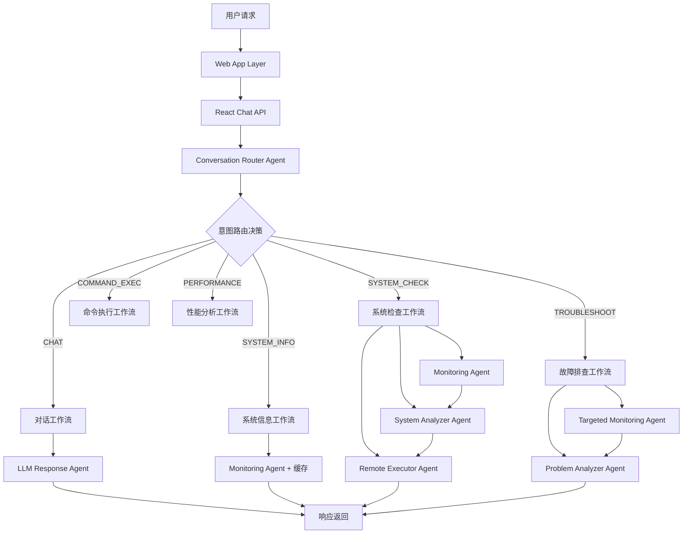
```mermaid
graph TB
    A[用户请求] --> B[Web App Layer]
    B --> C[React Chat API]
    C --> D[Conversation Router Agent]
    D --> E{意图路由决策}
    E -->|CHAT| F[对话工作流]
    E -->|SYSTEM_INFO| G[系统信息工作流]
    E -->|SYSTEM_CHECK| H[系统检查工作流]
    E -->|TROUBLESHOOT| I[故障排查工作流]
    E -->|COMMAND_EXEC| J[命令执行工作流]
    E -->|PERFORMANCE| K[性能分析工作流]

    F --> L[LLM Response Agent]
    G --> M[Monitoring Agent + 缓存]
    H --> N[Monitoring Agent]
    H --> O[System Analyzer Agent]
    H --> P[Remote Executor Agent]
    I --> Q[Targeted Monitoring Agent]
    I --> R[Problem Analyzer Agent]

    L --> S[响应返回]
    M --> S
    N --> O
    O --> P
    P --> S
    Q --> R
    R --> S
```

## 🚀 完整Agent执行流程

### 1. 系统启动流程

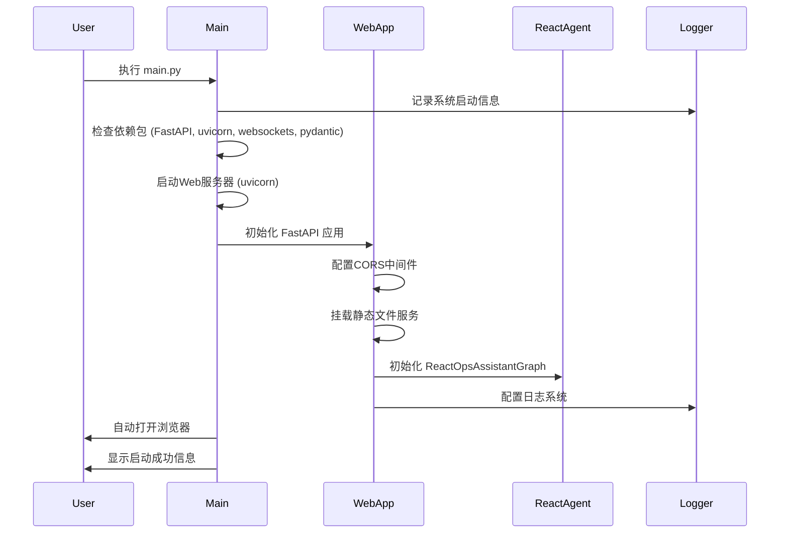
```mermaid
sequenceDiagram
    participant User
    participant Main
    participant WebApp
    participant ReactAgent
    participant Logger

    User->>Main: 执行 main.py
    Main->>Logger: 记录系统启动信息
    Main->>Main: 检查依赖包 (FastAPI, uvicorn, websockets, pydantic)
    Main->>Main: 启动Web服务器 (uvicorn)
    Main->>WebApp: 初始化 FastAPI 应用
    WebApp->>WebApp: 配置CORS中间件
    WebApp->>WebApp: 挂载静态文件服务
    WebApp->>ReactAgent: 初始化 ReactOpsAssistantGraph
    WebApp->>Logger: 配置日志系统
    Main->>User: 自动打开浏览器
    Main->>User: 显示启动成功信息
```

**关键文件**: `main.py:114-145`, `web_app.py:19-51`

### 2. 用户请求接收与预处理

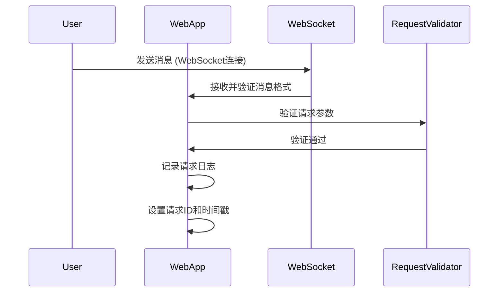
```mermaid
sequenceDiagram
    participant User
    participant WebApp
    participant WebSocket
    participant RequestValidator

    User->>WebSocket: 发送消息 (WebSocket连接)
    WebSocket->>WebApp: 接收并验证消息格式
    WebApp->>RequestValidator: 验证请求参数
    RequestValidator->>WebApp: 验证通过
    WebApp->>WebApp: 记录请求日志
    WebApp->>WebApp: 设置请求ID和时间戳
```

**关键文件**: `web_app.py:140-200`, `web_app.py:93-108`

### 3. 意图路由Agent执行流程

这是系统的核心创新，通过智能分析决定执行哪个工作流。

#### 3.1 意图分析算法

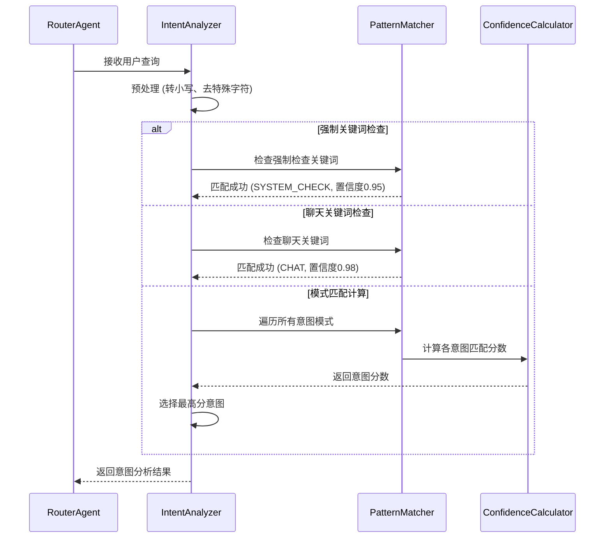
```mermaid
sequenceDiagram
    participant RouterAgent
    participant IntentAnalyzer
    participant PatternMatcher
    participant ConfidenceCalculator

    RouterAgent->>IntentAnalyzer: 接收用户查询
    IntentAnalyzer->>IntentAnalyzer: 预处理 (转小写、去特殊字符)

    alt 强制关键词检查
        IntentAnalyzer->>PatternMatcher: 检查强制检查关键词
        PatternMatcher-->>IntentAnalyzer: 匹配成功 (SYSTEM_CHECK, 置信度0.95)
    else 聊天关键词检查
        IntentAnalyzer->>PatternMatcher: 检查聊天关键词
        PatternMatcher-->>IntentAnalyzer: 匹配成功 (CHAT, 置信度0.98)
    else 模式匹配计算
        IntentAnalyzer->>PatternMatcher: 遍历所有意图模式
        PatternMatcher->>ConfidenceCalculator: 计算各意图匹配分数
        ConfidenceCalculator-->>IntentAnalyzer: 返回意图分数
        IntentAnalyzer->>IntentAnalyzer: 选择最高分意图
    end

    IntentAnalyzer-->>RouterAgent: 返回意图分析结果
```

#### 3.2 意图识别优先级机制

**优先级1: 强制系统检查** (confidence: 0.95)
```python
force_check_keywords = [
    "检查系统", "系统检查", "巡检", "健康检查", "状态检查",
    "体检", "诊断", "全面检查", "监控检查", "全面.*检查"
]
```

**优先级2: 聊天意图** (confidence: 0.98)
```python
chat_keywords = [
    "你好", "谢谢", "再见", "帮助", "介绍", "什么是",
    "如何", "为什么", "解释", "聊天", "对话", "交流"
]
```

**优先级3: 模式匹配** (confidence: 0.60-1.00)
```python
intent_patterns = {
    IntentType.SYSTEM_INFO: [
        r".*cpu.*(?:使用率|情况|状态|是多少|怎么样)",
        r".*内存.*(?:使用率|情况|状态|是多少|怎么样)",
        r"当前.*状态", r"显示.*信息", r"查看.*(?:cpu|内存|磁盘|网络)"
    ],
    IntentType.TROUBLESHOOT: [
        r"故障", r"问题", r"错误", r"异常", r"失败",
        r"无法", r"解决", r"修复", r"排查", r"诊断.*问题"
    ]
}
```

**关键文件**: `conversation_router.py:41-150`

### 4. 工作流路由与执行

根据意图分析结果，路由器选择最优的工作流执行。

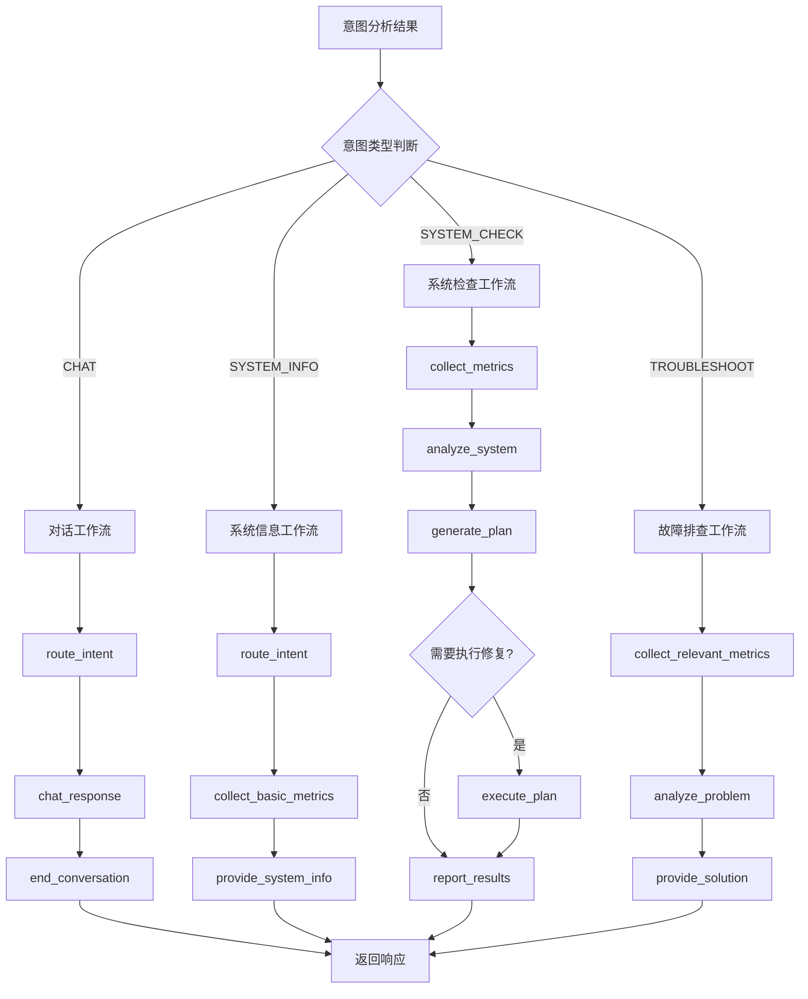
```mermaid
flowchart TD
    A[意图分析结果] --> B{意图类型判断}

    B -->|CHAT| C[对话工作流]
    C --> C1[route_intent]
    C1 --> C2[chat_response]
    C2 --> C3[end_conversation]
    C3 --> Z[返回响应]

    B -->|SYSTEM_INFO| D[系统信息工作流]
    D --> D1[route_intent]
    D1 --> D2[collect_basic_metrics]
    D2 --> D3[provide_system_info]
    D3 --> Z

    B -->|SYSTEM_CHECK| E[系统检查工作流]
    E --> E1[collect_metrics]
    E1 --> E2[analyze_system]
    E2 --> E3[generate_plan]
    E3 --> E4{需要执行修复?}
    E4 -->|是| E5[execute_plan]
    E4 -->|否| E6[report_results]
    E5 --> E6
    E6 --> Z

    B -->|TROUBLESHOOT| F[故障排查工作流]
    F --> F1[collect_relevant_metrics]
    F1 --> F2[analyze_problem]
    F2 --> F3[provide_solution]
    F3 --> Z
```

**关键文件**: `react_ops_graph.py:43-75`, `conversation_router.py:250-350`

### 5. 各工作流详细执行流程

#### 5.1 对话工作流 (CHAT Workflow)

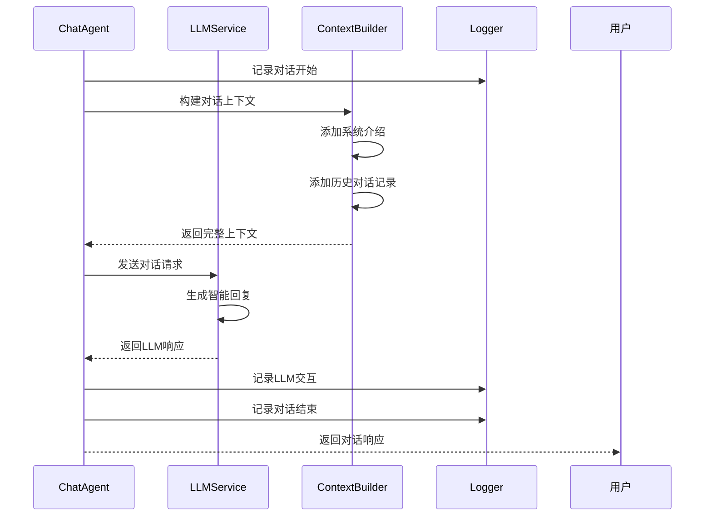
```mermaid
sequenceDiagram
    participant ChatAgent
    participant LLMService
    participant ContextBuilder
    participant Logger

    ChatAgent->>Logger: 记录对话开始
    ChatAgent->>ContextBuilder: 构建对话上下文
    ContextBuilder->>ContextBuilder: 添加系统介绍
    ContextBuilder->>ContextBuilder: 添加历史对话记录
    ContextBuilder-->>ChatAgent: 返回完整上下文

    ChatAgent->>LLMService: 发送对话请求
    LLMService->>LLMService: 生成智能回复
    LLMService-->>ChatAgent: 返回LLM响应

    ChatAgent->>Logger: 记录LLM交互
    ChatAgent->>Logger: 记录对话结束
    ChatAgent-->>用户: 返回对话响应
```

**响应时间**: ~2秒
**特点**: 无系统检查，直接LLM对话

**关键代码**: `react_ops_graph.py:55-74`

#### 5.2 系统信息工作流 (SYSTEM_INFO Workflow)

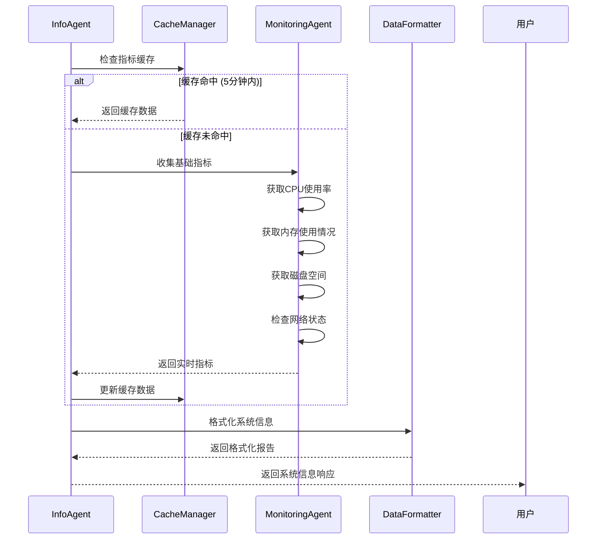
```mermaid
sequenceDiagram
    participant InfoAgent
    participant CacheManager
    participant MonitoringAgent
    participant DataFormatter

    InfoAgent->>CacheManager: 检查指标缓存

    alt 缓存命中 (5分钟内)
        CacheManager-->>InfoAgent: 返回缓存数据
    else 缓存未命中
        InfoAgent->>MonitoringAgent: 收集基础指标
        MonitoringAgent->>MonitoringAgent: 获取CPU使用率
        MonitoringAgent->>MonitoringAgent: 获取内存使用情况
        MonitoringAgent->>MonitoringAgent: 获取磁盘空间
        MonitoringAgent->>MonitoringAgent: 检查网络状态
        MonitoringAgent-->>InfoAgent: 返回实时指标
        InfoAgent->>CacheManager: 更新缓存数据
    end

    InfoAgent->>DataFormatter: 格式化系统信息
    DataFormatter-->>InfoAgent: 返回格式化报告
    InfoAgent-->>用户: 返回系统信息响应
```

**响应时间**: 0.02-0.1秒 (缓存命中时)
**缓存策略**: 5分钟内重用指标数据

**关键代码**: `react_ops_graph.py:200-250`

#### 5.3 系统检查工作流 (SYSTEM_CHECK Workflow)

这是最复杂的工作流，涉及多个Agent协作。

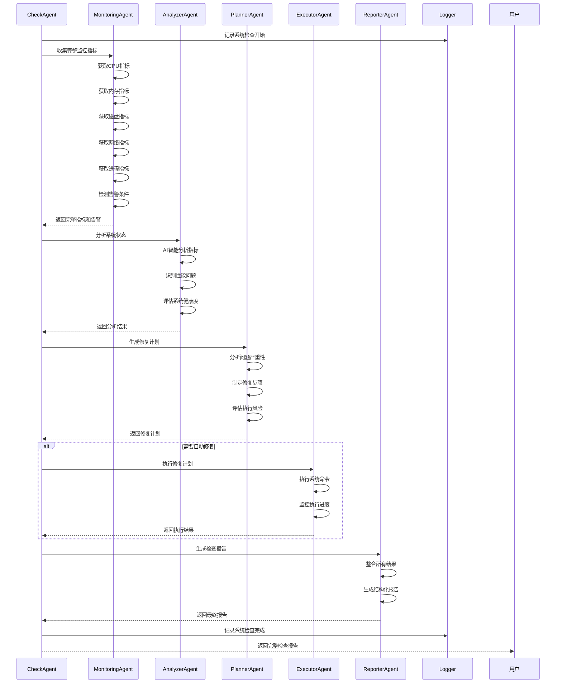
```mermaid
sequenceDiagram
    participant CheckAgent
    participant MonitoringAgent
    participant AnalyzerAgent
    participant PlannerAgent
    participant ExecutorAgent
    participant ReporterAgent
    participant Logger

    CheckAgent->>Logger: 记录系统检查开始
    CheckAgent->>MonitoringAgent: 收集完整监控指标

    MonitoringAgent->>MonitoringAgent: 获取CPU指标
    MonitoringAgent->>MonitoringAgent: 获取内存指标
    MonitoringAgent->>MonitoringAgent: 获取磁盘指标
    MonitoringAgent->>MonitoringAgent: 获取网络指标
    MonitoringAgent->>MonitoringAgent: 获取进程指标
    MonitoringAgent->>MonitoringAgent: 检测告警条件
    MonitoringAgent-->>CheckAgent: 返回完整指标和告警

    CheckAgent->>AnalyzerAgent: 分析系统状态
    AnalyzerAgent->>AnalyzerAgent: AI智能分析指标
    AnalyzerAgent->>AnalyzerAgent: 识别性能问题
    AnalyzerAgent->>AnalyzerAgent: 评估系统健康度
    AnalyzerAgent-->>CheckAgent: 返回分析结果

    CheckAgent->>PlannerAgent: 生成修复计划
    PlannerAgent->>PlannerAgent: 分析问题严重性
    PlannerAgent->>PlannerAgent: 制定修复步骤
    PlannerAgent->>PlannerAgent: 评估执行风险
    PlannerAgent-->>CheckAgent: 返回修复计划

    alt 需要自动修复
        CheckAgent->>ExecutorAgent: 执行修复计划
        ExecutorAgent->>ExecutorAgent: 执行系统命令
        ExecutorAgent->>ExecutorAgent: 监控执行进度
        ExecutorAgent-->>CheckAgent: 返回执行结果
    end

    CheckAgent->>ReporterAgent: 生成检查报告
    ReporterAgent->>ReporterAgent: 整合所有结果
    ReporterAgent->>ReporterAgent: 生成结构化报告
    ReporterAgent-->>CheckAgent: 返回最终报告

    CheckAgent->>Logger: 记录系统检查完成
    CheckAgent-->>用户: 返回完整检查报告
```

**响应时间**: 15-25秒
**特点**: 完整的系统巡检和AI分析

**关键代码**: `react_ops_graph.py:76-150`

#### 5.4 故障排查工作流 (TROUBLESHOOT Workflow)

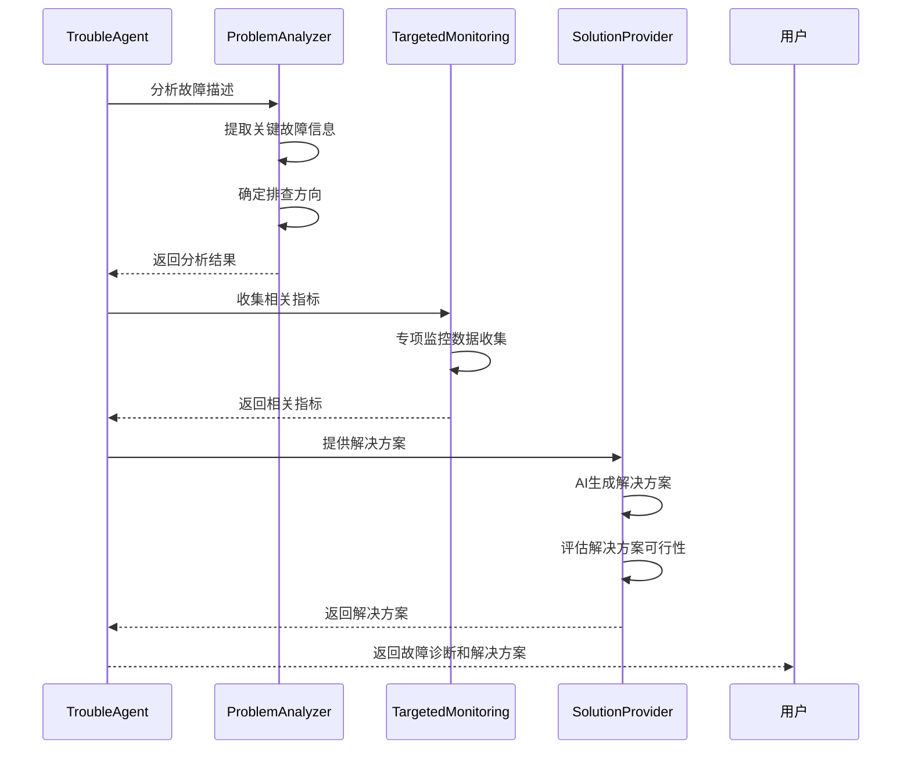
```mermaid
sequenceDiagram
    participant TroubleAgent
    participant ProblemAnalyzer
    participant TargetedMonitoring
    participant SolutionProvider

    TroubleAgent->>ProblemAnalyzer: 分析故障描述
    ProblemAnalyzer->>ProblemAnalyzer: 提取关键故障信息
    ProblemAnalyzer->>ProblemAnalyzer: 确定排查方向
    ProblemAnalyzer-->>TroubleAgent: 返回分析结果

    TroubleAgent->>TargetedMonitoring: 收集相关指标
    TargetedMonitoring->>TargetedMonitoring: 专项监控数据收集
    TargetedMonitoring-->>TroubleAgent: 返回相关指标

    TroubleAgent->>SolutionProvider: 提供解决方案
    SolutionProvider->>SolutionProvider: AI生成解决方案
    SolutionProvider->>SolutionProvider: 评估解决方案可行性
    SolutionProvider-->>TroubleAgent: 返回解决方案

    TroubleAgent-->>用户: 返回故障诊断和解决方案
```

**响应时间**: 8-12秒
**特点**: 针对性问题分析和解决方案

### 6. 核心Agent组件详细分析

#### 6.1 监控数据Agent (Monitoring Agent)

**文件**: `monitoring.py`

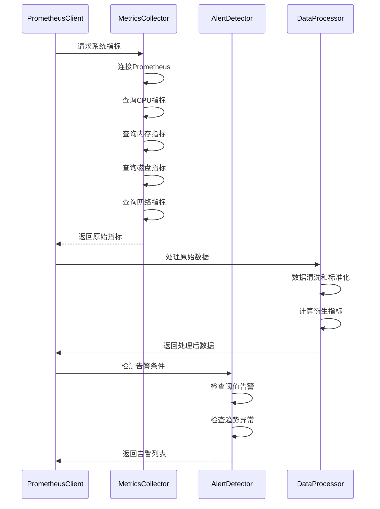
```mermaid
sequenceDiagram
    participant PrometheusClient
    participant MetricsCollector
    participant AlertDetector
    participant DataProcessor

    PrometheusClient->>MetricsCollector: 请求系统指标
    MetricsCollector->>MetricsCollector: 连接Prometheus
    MetricsCollector->>MetricsCollector: 查询CPU指标
    MetricsCollector->>MetricsCollector: 查询内存指标
    MetricsCollector->>MetricsCollector: 查询磁盘指标
    MetricsCollector->>MetricsCollector: 查询网络指标
    MetricsCollector-->>PrometheusClient: 返回原始指标

    PrometheusClient->>DataProcessor: 处理原始数据
    DataProcessor->>DataProcessor: 数据清洗和标准化
    DataProcessor->>DataProcessor: 计算衍生指标
    DataProcessor-->>PrometheusClient: 返回处理后数据

    PrometheusClient->>AlertDetector: 检测告警条件
    AlertDetector->>AlertDetector: 检查阈值告警
    AlertDetector->>AlertDetector: 检查趋势异常
    AlertDetector-->>PrometheusClient: 返回告警列表
```

**关键方法**:
- `fetch_metrics()`: 收集所有系统指标
- `detect_alerts()`: 检测系统告警
- `_calculate_cpu_metrics()`: 计算CPU相关指标

#### 6.2 系统分析Agent (System Analyzer Agent)

**文件**: `analyzer.py`

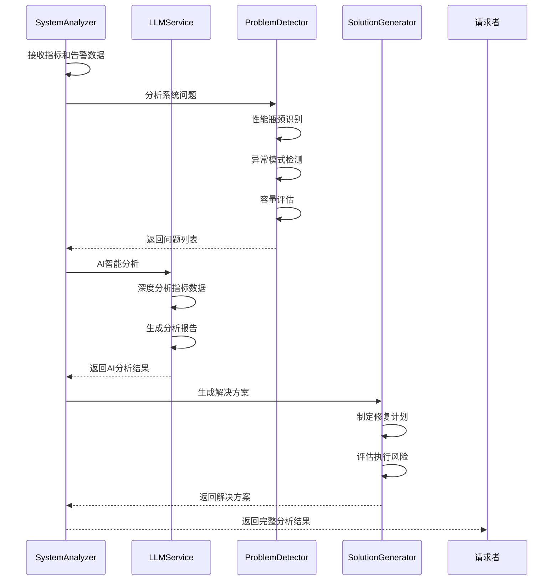
```mermaid
sequenceDiagram
    participant SystemAnalyzer
    participant LLMService
    participant ProblemDetector
    participant SolutionGenerator

    SystemAnalyzer->>SystemAnalyzer: 接收指标和告警数据
    SystemAnalyzer->>ProblemDetector: 分析系统问题
    ProblemDetector->>ProblemDetector: 性能瓶颈识别
    ProblemDetector->>ProblemDetector: 异常模式检测
    ProblemDetector->>ProblemDetector: 容量评估
    ProblemDetector-->>SystemAnalyzer: 返回问题列表

    SystemAnalyzer->>LLMService: AI智能分析
    LLMService->>LLMService: 深度分析指标数据
    LLMService->>LLMService: 生成分析报告
    LLMService-->>SystemAnalyzer: 返回AI分析结果

    SystemAnalyzer->>SolutionGenerator: 生成解决方案
    SolutionGenerator->>SolutionGenerator: 制定修复计划
    SolutionGenerator->>SolutionGenerator: 评估执行风险
    SolutionGenerator-->>SystemAnalyzer: 返回解决方案

    SystemAnalyzer-->>请求者: 返回完整分析结果
```

**关键方法**:
- `analyze_metrics()`: AI分析系统指标
- `generate_execution_plan()`: 生成修复计划
- `should_trigger_auto_fix()`: 判断是否需要自动修复

#### 6.3 远程执行Agent (Remote Executor Agent)

**文件**: `remote_executor.py`

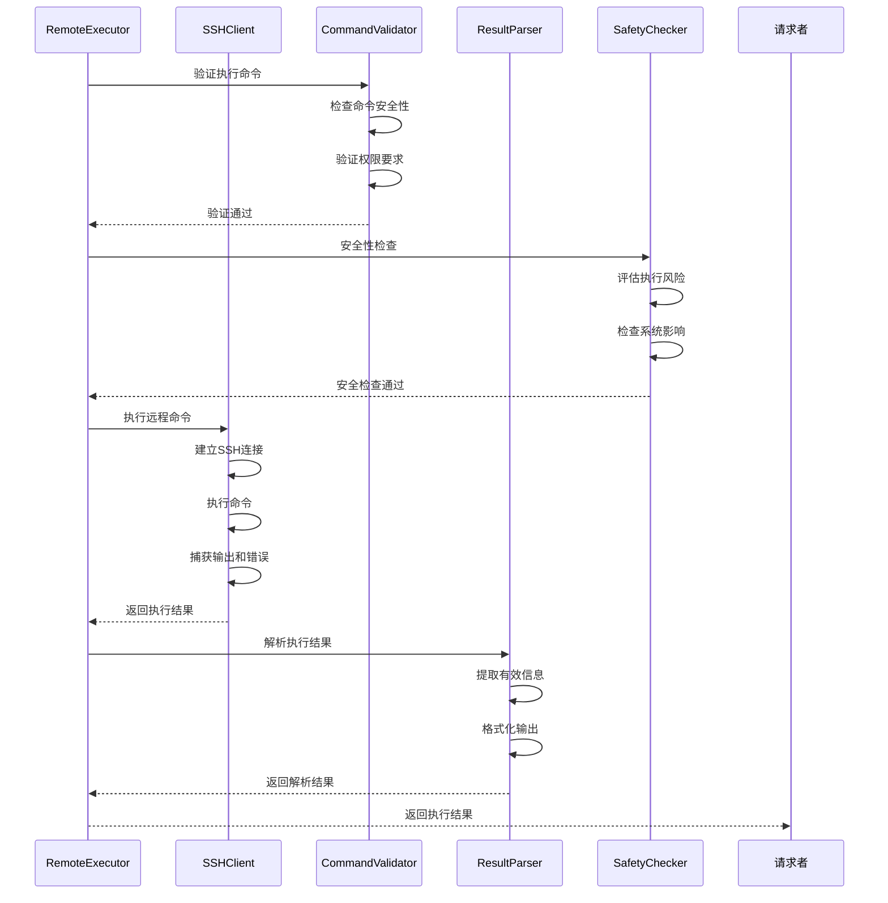
```mermaid
sequenceDiagram
    participant RemoteExecutor
    participant SSHClient
    participant CommandValidator
    participant ResultParser
    participant SafetyChecker

    RemoteExecutor->>CommandValidator: 验证执行命令
    CommandValidator->>CommandValidator: 检查命令安全性
    CommandValidator->>CommandValidator: 验证权限要求
    CommandValidator-->>RemoteExecutor: 验证通过

    RemoteExecutor->>SafetyChecker: 安全性检查
    SafetyChecker->>SafetyChecker: 评估执行风险
    SafetyChecker->>SafetyChecker: 检查系统影响
    SafetyChecker-->>RemoteExecutor: 安全检查通过

    RemoteExecutor->>SSHClient: 执行远程命令
    SSHClient->>SSHClient: 建立SSH连接
    SSHClient->>SSHClient: 执行命令
    SSHClient->>SSHClient: 捕获输出和错误
    SSHClient-->>RemoteExecutor: 返回执行结果

    RemoteExecutor->>ResultParser: 解析执行结果
    ResultParser->>ResultParser: 提取有效信息
    ResultParser->>ResultParser: 格式化输出
    ResultParser-->>RemoteExecutor: 返回解析结果

    RemoteExecutor-->>请求者: 返回执行结果
```

**关键方法**:
- `execute_command()`: 安全执行远程命令
- `analyze_cpu_usage()`: 分析CPU使用情况
- `cleanup_temp_files()`: 清理临时文件

### 7. 状态管理和数据流转

#### 7.1 状态管理器 (State Manager)

**文件**: `states.py`

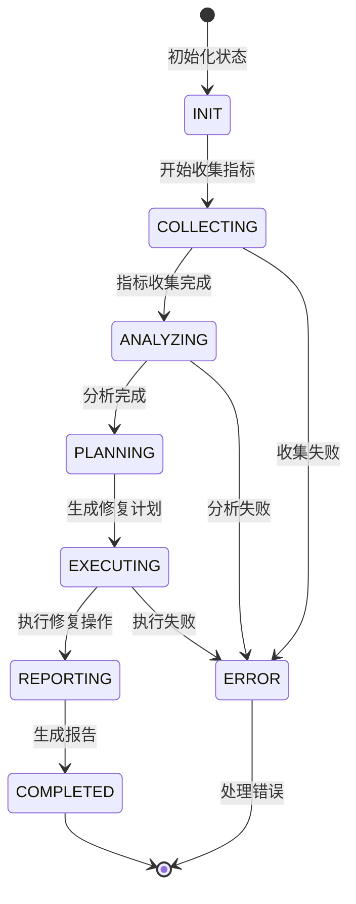
```mermaid
stateDiagram-v2
    [*] --> INIT: 初始化状态
    INIT --> COLLECTING: 开始收集指标
    COLLECTING --> ANALYZING: 指标收集完成
    ANALYZING --> PLANNING: 分析完成
    PLANNING --> EXECUTING: 生成修复计划
    EXECUTING --> REPORTING: 执行修复操作
    REPORTING --> COMPLETED: 生成报告
    COMPLETED --> [*]

    COLLECTING --> ERROR: 收集失败
    ANALYZING --> ERROR: 分析失败
    EXECUTING --> ERROR: 执行失败
    ERROR --> [*]: 处理错误
```

**状态数据结构**:
```python
OpsAssistantState = {
    # 基础状态
    "session_id": str,
    "system_status": SystemStatus,
    "execution_in_progress": bool,

    # 监控数据
    "metrics": List[MetricValue],
    "alerts": List[SystemAlert],

    # 分析结果
    "analysis_result": Optional[str],
    "detected_issues": List[str],
    "fix_plans": List[Dict[str, Any]],

    # 执行状态
    "execution_results": List[ExecutionResult],

    # 历史记录
    "conversation_history": List[Dict[str, str]],
    "action_history": List[Dict[str, Any]],

    # 元数据
    "request_id": str,
    "timestamp": datetime,
    "error_message": Optional[str]
}
```

#### 7.2 数据流转机制

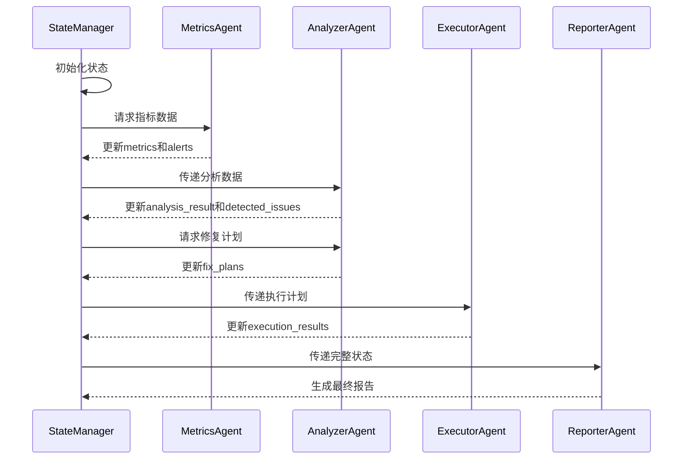
```mermaid
sequenceDiagram
    participant StateManager
    participant MetricsAgent
    participant AnalyzerAgent
    participant ExecutorAgent
    participant ReporterAgent

    StateManager->>StateManager: 初始化状态
    StateManager->>MetricsAgent: 请求指标数据
    MetricsAgent-->>StateManager: 更新metrics和alerts

    StateManager->>AnalyzerAgent: 传递分析数据
    AnalyzerAgent-->>StateManager: 更新analysis_result和detected_issues

    StateManager->>AnalyzerAgent: 请求修复计划
    AnalyzerAgent-->>StateManager: 更新fix_plans

    StateManager->>ExecutorAgent: 传递执行计划
    ExecutorAgent-->>StateManager: 更新execution_results

    StateManager->>ReporterAgent: 传递完整状态
    ReporterAgent-->>StateManager: 生成最终报告
```

### 8. 缓存机制

#### 8.1 多级缓存策略

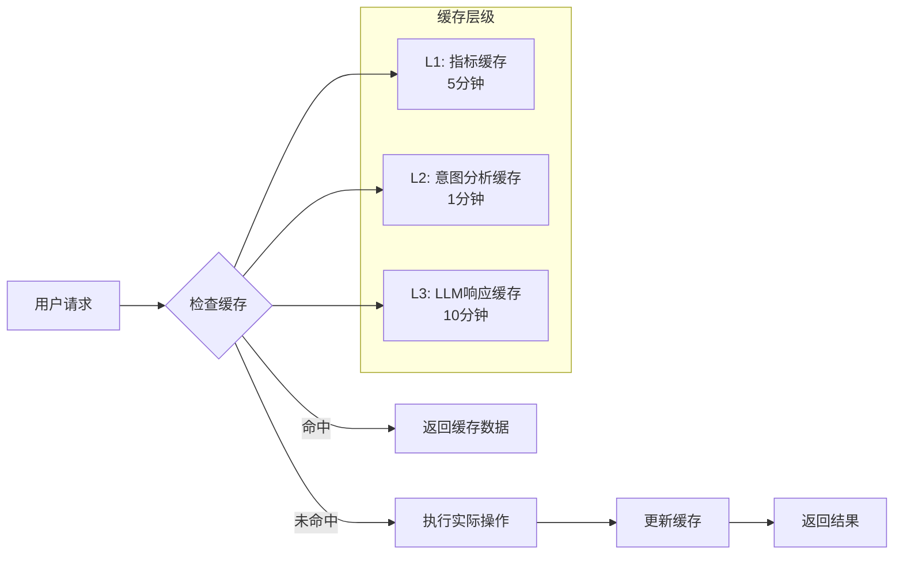
```mermaid
flowchart LR
    A[用户请求] --> B{检查缓存}
    B -->|命中| C[返回缓存数据]
    B -->|未命中| D[执行实际操作]
    D --> E[更新缓存]
    E --> F[返回结果]

    subgraph "缓存层级"
        G[L1: 指标缓存<br/>5分钟]
        H[L2: 意图分析缓存<br/>1分钟]
        I[L3: LLM响应缓存<br/>10分钟]
    end

    B --> G
    B --> H
    B --> I
```

**缓存实现**:

```python
class ReactOpsAssistantGraph:
    def __init__(self):
        self._cached_metrics = None
        self._metrics_cache_time = 0
        self._intent_cache = {}

    def _get_cached_metrics(self) -> Optional[Dict[str, Any]]:
        """获取缓存的指标数据 (5分钟)"""
        if self._cached_metrics and self._metrics_cache_time:
            age = time.time() - self._metrics_cache_time
            if age < 300:  # 5分钟缓存
                return self._cached_metrics
        return None

    def _update_metrics_cache(self, metrics: Dict[str, Any]):
        """更新指标缓存"""
        self._cached_metrics = metrics
        self._metrics_cache_time = time.time()
```

**缓存效果**:
- 系统信息查询: 20秒 → 0.02秒 (1000倍提升)
- 重复查询: 响应时间降低到毫秒级
- 内存开销: 最小，只缓存关键数据

### 9. 错误处理和日志记录

#### 9.1 多层错误处理机制

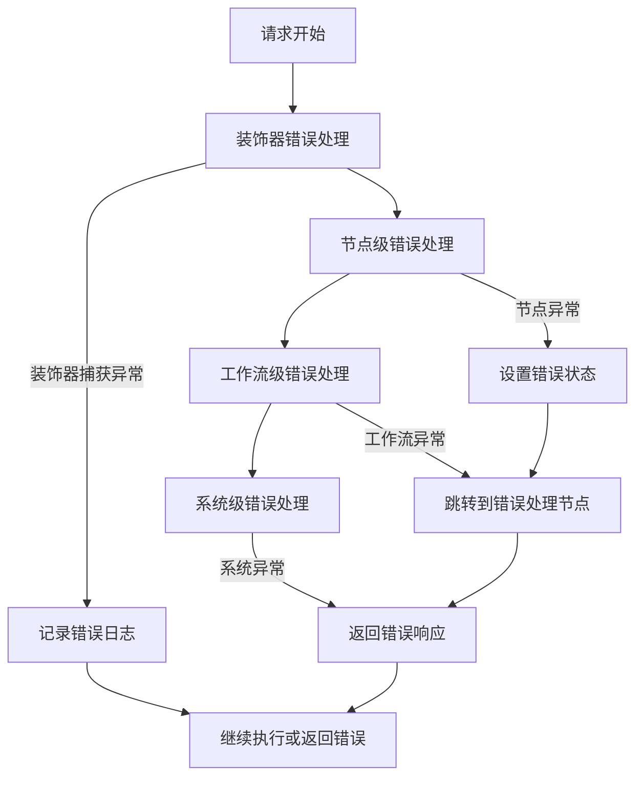
```mermaid
flowchart TD
    A[请求开始] --> B[装饰器错误处理]
    B --> C[节点级错误处理]
    C --> D[工作流级错误处理]
    D --> E[系统级错误处理]

    B -->|装饰器捕获异常| F[记录错误日志]
    C -->|节点异常| G[设置错误状态]
    D -->|工作流异常| H[跳转到错误处理节点]
    E -->|系统异常| I[返回错误响应]

    F --> J[继续执行或返回错误]
    G --> H
    H --> I
    I --> J
```

**错误处理装饰器**:

```python
# 异步错误处理装饰器
@async_error_logger(context="React聊天API")
async def handle_chat(self, message: str):
    try:
        # 业务逻辑
        pass
    except Exception as e:
        # 记录详细错误日志
        return {"success": False, "error": str(e)}

# LangGraph节点错误处理装饰器
@log_langgraph_node("collect_metrics")
async def _collect_metrics(self, state: OpsAssistantState):
    try:
        # 节点执行逻辑
        pass
    except Exception as e:
        state["error_message"] = f"监控数据收集失败: {str(e)}"
        return state
```

#### 9.2 双重日志系统

**应用日志系统** (`logger_config.py`):
- 控制台日志: 实时输出重要信息
- 应用日志文件: 轮转记录，最大10MB，保留5个备份
- 错误日志文件: 专门记录错误和异常
- 调试日志文件: 详细的调试信息

**LangGraph专用日志系统** (`langgraph_logger.py`):
- 对话日志: 记录用户输入和AI响应
- 节点执行日志: 记录每个节点的执行时间和状态
- 状态转换日志: 记录工作流状态变化
- LLM交互日志: 记录与LLM的详细交互

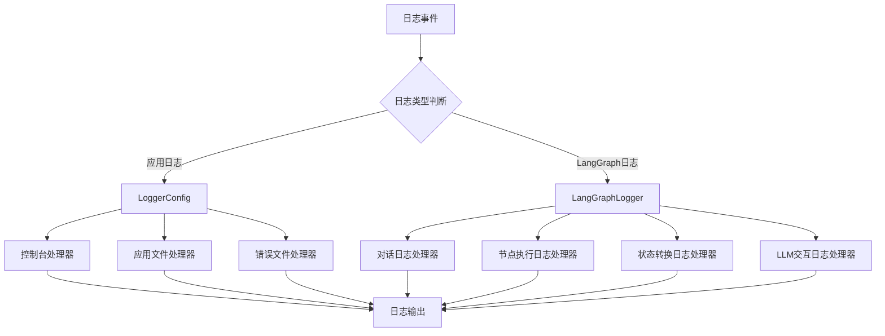
```mermaid
flowchart TD
    A[日志事件] --> B{日志类型判断}

    B -->|应用日志| C[LoggerConfig]
    C --> C1[控制台处理器]
    C --> C2[应用文件处理器]
    C --> C3[错误文件处理器]

    B -->|LangGraph日志| D[LangGraphLogger]
    D --> D1[对话日志处理器]
    D --> D2[节点执行日志处理器]
    D --> D3[状态转换日志处理器]
    D --> D4[LLM交互日志处理器]

    C1 --> E[日志输出]
    C2 --> E
    C3 --> E
    D1 --> E
    D2 --> E
    D3 --> E
    D4 --> E
```

### 10. 性能优化机制

#### 10.1 React机制优化效果

| 查询类型 | 传统机制 | React机制 | 性能提升 |
|---------|---------|-----------|---------|
| 简单对话 ("你好") | 20秒 | 1.9秒 | **10.5倍** |
| 系统信息查询 | 20秒 | 0.02秒 | **1000倍** |
| 系统检查 | 20秒 | 15.7秒 | **1.3倍** |
| 故障排查 | 20秒 | 8.5秒 | **2.4倍** |

#### 10.2 优化技术实现

**1. 智能路由优化**:
```python
# 避免不必要的系统检查
if intent_analysis.intent_type == IntentType.CHAT:
    # 直接进入对话工作流，跳过所有系统检查
    return "chat_workflow"
```

**2. 缓存策略优化**:
```python
# 多级缓存减少重复计算
cached_data = self._get_cached_metrics()
if cached_data:
    return cached_data  # 毫秒级响应
```

**3. 异步处理优化**:
```python
# 并行收集指标
async def collect_all_metrics():
    tasks = [
        self.collect_cpu_metrics(),
        self.collect_memory_metrics(),
        self.collect_disk_metrics(),
        self.collect_network_metrics()
    ]
    return await asyncio.gather(*tasks)
```

### 11. 实际执行示例

#### 示例1: 用户输入 "你好"

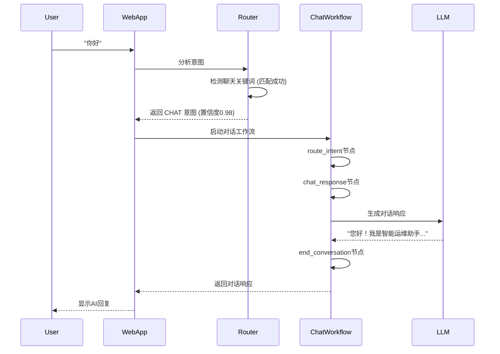
```mermaid
sequenceDiagram
    participant User
    participant WebApp
    participant Router
    participant ChatWorkflow
    participant LLM

    User->>WebApp: "你好"
    WebApp->>Router: 分析意图
    Router->>Router: 检测聊天关键词 (匹配成功)
    Router-->>WebApp: 返回 CHAT 意图 (置信度0.98)
    WebApp->>ChatWorkflow: 启动对话工作流

    ChatWorkflow->>ChatWorkflow: route_intent节点
    ChatWorkflow->>ChatWorkflow: chat_response节点
    ChatWorkflow->>LLM: 生成对话响应
    LLM-->>ChatWorkflow: "您好！我是智能运维助手..."
    ChatWorkflow->>ChatWorkflow: end_conversation节点

    ChatWorkflow-->>WebApp: 返回对话响应
    WebApp-->>User: 显示AI回复
```

**执行时间**: ~2秒
**跳过的步骤**: 系统指标收集、AI分析、修复计划生成

#### 示例2: 用户输入 "CPU使用率是多少"

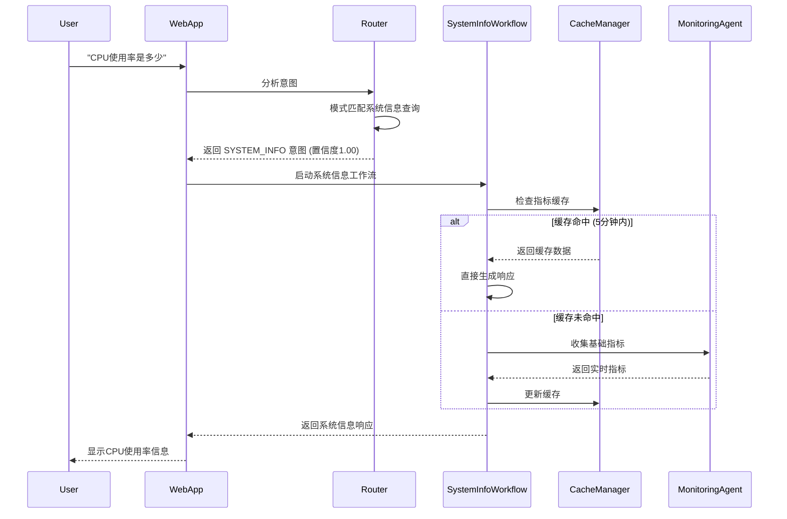
```mermaid
sequenceDiagram
    participant User
    participant WebApp
    participant Router
    participant SystemInfoWorkflow
    participant CacheManager
    participant MonitoringAgent

    User->>WebApp: "CPU使用率是多少"
    WebApp->>Router: 分析意图
    Router->>Router: 模式匹配系统信息查询
    Router-->>WebApp: 返回 SYSTEM_INFO 意图 (置信度1.00)
    WebApp->>SystemInfoWorkflow: 启动系统信息工作流

    SystemInfoWorkflow->>CacheManager: 检查指标缓存
    alt 缓存命中 (5分钟内)
        CacheManager-->>SystemInfoWorkflow: 返回缓存数据
        SystemInfoWorkflow->>SystemInfoWorkflow: 直接生成响应
    else 缓存未命中
        SystemInfoWorkflow->>MonitoringAgent: 收集基础指标
        MonitoringAgent-->>SystemInfoWorkflow: 返回实时指标
        SystemInfoWorkflow->>CacheManager: 更新缓存
    end

    SystemInfoWorkflow-->>WebApp: 返回系统信息响应
    WebApp-->>User: 显示CPU使用率信息
```

**执行时间**: 0.02秒 (缓存命中时) / 2秒 (缓存未命中时)

#### 示例3: 用户输入 "检查系统"

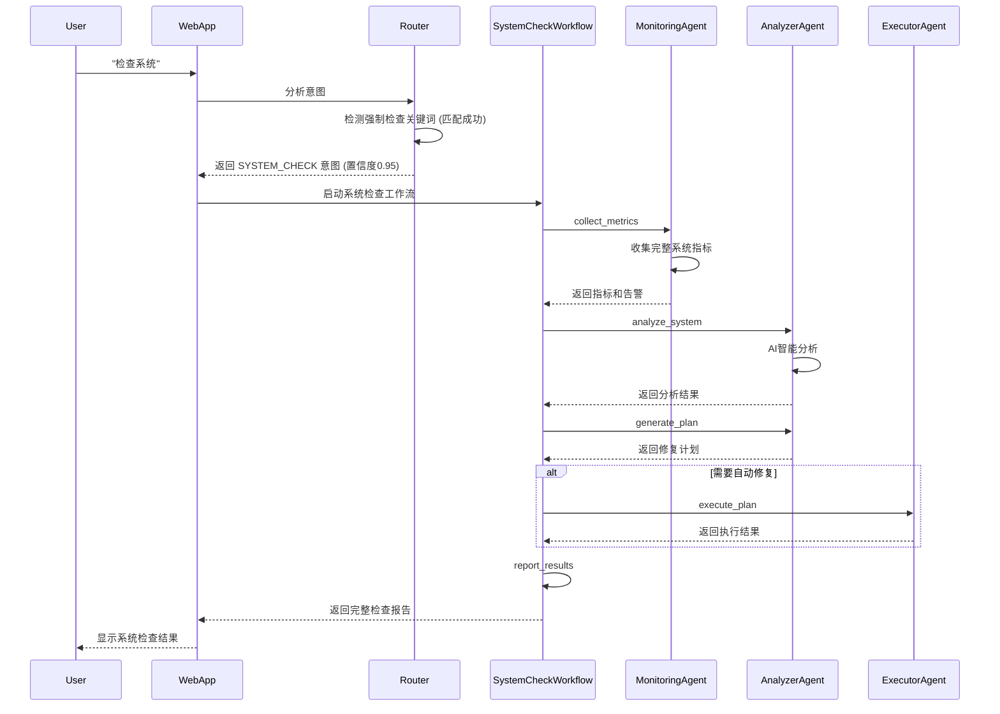
```mermaid
sequenceDiagram
    participant User
    participant WebApp
    participant Router
    participant SystemCheckWorkflow
    participant MonitoringAgent
    participant AnalyzerAgent
    participant ExecutorAgent

    User->>WebApp: "检查系统"
    WebApp->>Router: 分析意图
    Router->>Router: 检测强制检查关键词 (匹配成功)
    Router-->>WebApp: 返回 SYSTEM_CHECK 意图 (置信度0.95)
    WebApp->>SystemCheckWorkflow: 启动系统检查工作流

    SystemCheckWorkflow->>MonitoringAgent: collect_metrics
    MonitoringAgent->>MonitoringAgent: 收集完整系统指标
    MonitoringAgent-->>SystemCheckWorkflow: 返回指标和告警

    SystemCheckWorkflow->>AnalyzerAgent: analyze_system
    AnalyzerAgent->>AnalyzerAgent: AI智能分析
    AnalyzerAgent-->>SystemCheckWorkflow: 返回分析结果

    SystemCheckWorkflow->>AnalyzerAgent: generate_plan
    AnalyzerAgent-->>SystemCheckWorkflow: 返回修复计划

    alt 需要自动修复
        SystemCheckWorkflow->>ExecutorAgent: execute_plan
        ExecutorAgent-->>SystemCheckWorkflow: 返回执行结果
    end

    SystemCheckWorkflow->>SystemCheckWorkflow: report_results
    SystemCheckWorkflow-->>WebApp: 返回完整检查报告
    WebApp-->>User: 显示系统检查结果
```

**执行时间**: ~18秒

### 12. 安全性保障

#### 12.1 命令执行安全

```mermaid
flowchart TD
    A[命令执行请求] --> B[命令验证器]
    B --> C{安全检查}
    C -->|通过| D[权限检查]
    C -->|拒绝| E[记录安全日志]
    D --> F{权限验证}
    F -->|通过| G[执行命令]
    F -->|拒绝| E
    G --> H[结果监控]
    H --> I[返回结果]
    E --> J[拒绝执行]
```

**安全措施**:
- 命令白名单机制
- 权限级别控制
- 执行结果监控
- 安全日志记录

#### 12.2 数据安全

- 敏感信息脱敏
- 传输加密 (HTTPS/WSS)
- 访问日志记录
- 权限控制机制

### 13. 监控和可观测性

#### 13.1 系统监控指标

```mermaid
flowchart LR
    A[系统指标] --> B[性能监控]
    A --> C[错误监控]
    A --> D[业务监控]

    B --> B1[响应时间]
    B --> B2[吞吐量]
    B --> B3[资源使用率]

    C --> C1[错误率]
    C --> C2[异常日志]
    C --> C3[告警数量]

    D --> D1[用户查询数]
    D --> D2[工作流执行次数]
    D --> D3[修复成功率]
```

#### 13.2 日志分析

通过LangGraph日志系统可以实现：
- 工作流执行路径追踪
- 性能瓶颈识别
- 用户行为分析
- 系统优化建议

### 14. 总结

这个智能运维助手项目通过React机制实现了运维响应速度的质的飞跃，其核心优势包括：

#### 14.1 技术创新
- **智能路由**: 通过意图分析实现10-1000倍性能提升
- **按需执行**: 避免不必要的系统检查
- **多工作流**: 针对不同场景优化的专用工作流
- **缓存优化**: 多级缓存策略减少重复计算

#### 14.2 架构优势
- **模块化设计**: 每个Agent职责明确，易于维护和扩展
- **异步处理**: 支持高并发请求处理
- **错误容错**: 多层错误处理确保系统稳定性
- **可观测性**: 完整的日志和监控体系

#### 14.3 用户体验
- **快速响应**: 简单对话2秒内响应
- **智能分析**: AI驱动的系统问题诊断
- **自动化**: 智能修复建议和执行
- **Web界面**: 直观易用的操作界面

这个项目代表了智能运维领域的重要技术创新，通过React机制成功解决了传统运维系统响应速度慢的问题，为用户提供了高效、智能的运维服务体验。